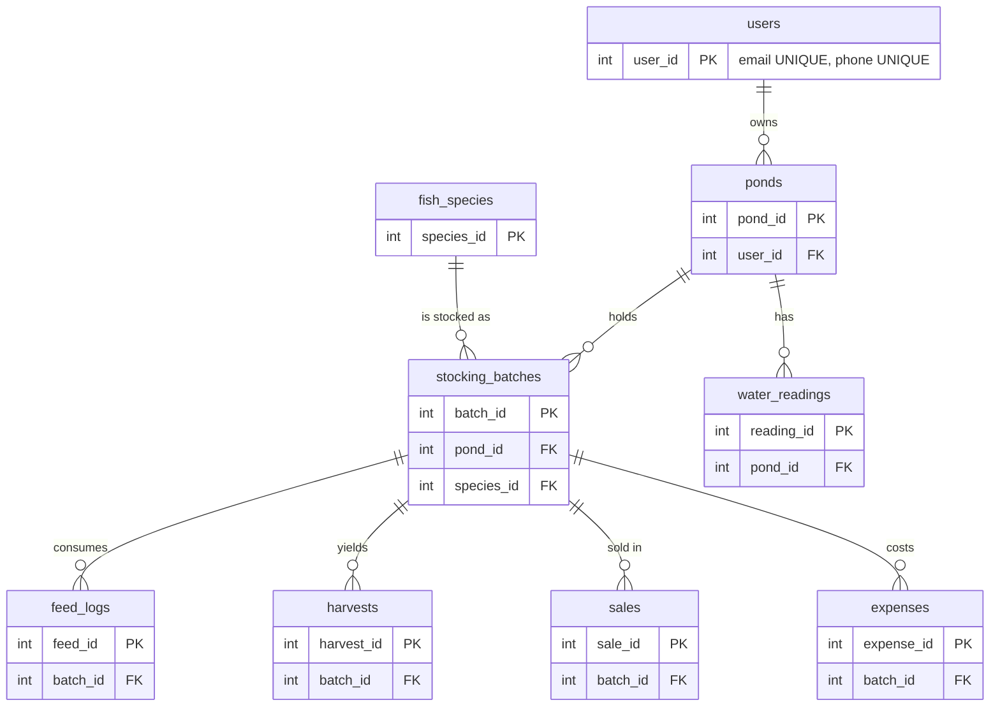

# Pukur Pulse — ER Diagram

```mermaid
erDiagram
  users ||--o{ ponds : owns
  ponds ||--o{ stocking_batches : holds
  fish_species ||--o{ stocking_batches : "is stocked as"
  ponds ||--o{ water_readings : has
  stocking_batches ||--o{ feed_logs : consumes
  stocking_batches ||--o{ harvests : yields
  stocking_batches ||--o{ sales : "sold in"
  stocking_batches ||--o{ expenses : costs

  users { int user_id PK "email UNIQUE, phone UNIQUE" }
  ponds { int pond_id PK  int user_id FK }
  fish_species { int species_id PK }
  stocking_batches { int batch_id PK  int pond_id FK  int species_id FK }
  feed_logs { int feed_id PK  int batch_id FK }
  water_readings { int reading_id PK  int pond_id FK }
  harvests { int harvest_id PK  int batch_id FK }
  sales { int sale_id PK  int batch_id FK }
  expenses { int expense_id PK  int batch_id FK }
```
